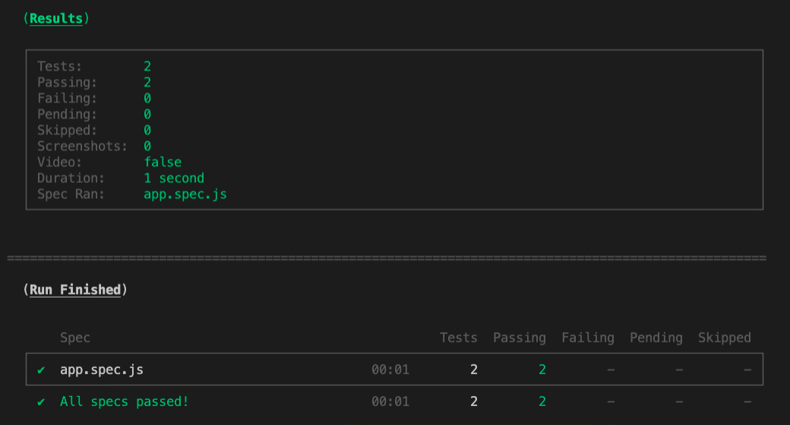

<p align="middle" >
  
</p>
<h1 align="middle">nan-noo's 숫자 야구 게임</h1>

## 구현 기능 목록

- [x] 세자리 랜덤 수(정답) 생성(숫자 중복 x, 1 ~ 9까지)
- [x] 사용자로부터 입력 받기
- [x] 입력 값이 세자리 수인지 확인: 잘못된 입력이면 alert 및 다시 입력
- [x] 입력 값과 정답 비교: 정답, 스트라이크, 볼, 낫싱
- [x] 각 라운드 결과 화면에 표시
- [ ] 게임 종료 후(정답 맞춤) 재시작 버튼 화면에 표시

---

## 🎯 게임 방법

기본적으로 1부터 9까지 서로 다른 수로 이루어진 3자리의 수를 맞추는 게임이다.

- 같은 수가 같은 자리에 있으면 `스트라이크`, 다른 자리에 있으면 `볼`, 같은 수가 전혀 없으면 `낫싱`이란 힌트를 얻고, 그 힌트를 이용해서 먼저 상대방(컴퓨터)의 수를 맞추면 승리한다.
  - 예) 상대방(컴퓨터)의 수가 425일 때
    - 123을 제시한 경우 : 1스트라이크
    - 456을 제시한 경우 : 1볼 1스트라이크
    - 789를 제시한 경우 : 낫싱
- 위 숫자 야구게임에서 상대방의 역할을 컴퓨터가 한다. 컴퓨터는 1에서 9까지 서로 다른 임의의 수 3개를 선택한다. 게임 플레이어는 컴퓨터가 생각하고 있는 3개의 숫자를 입력하고, 컴퓨터는 입력한 숫자에 대한 결과를 출력한다.
- 이 같은 과정을 반복해 컴퓨터가 선택한 3개의 숫자를 모두 맞히면 게임이 종료되고, 재시작 버튼이 노출된다.
- 게임이 종료된 후 재시작 버튼을 클릭해 게임을 다시 시작할 수 있다.

---

## 💻 실행 결과


---

## 라이브러리

- [`MissionUtils` 라이브러리](https://github.com/woowacourse-projects/javascript-mission-utils#mission-utils)의 `Random.pickNumberInRange`를 사용. (`MissionUtils`은 window객체 내에 포함되어 있음)

---

## ✔️ 테스트 실행 가이드

- 테스트 실행에 필요한 패키지 설치를 위해 `Node.js` 버전 `14` 이상이 필요하다.
- 다음 명령어를 입력해 패키지를 설치한다.

```bash
  // {폴더 경로}/javascript-baseball-precourse/ 에서
  npm install
```

- 설치가 완료되었다면, 다음 명령어를 입력해 테스트를 실행한다.

```bash
  // {폴더 경로}/javascript-baseball-precourse/ 에서
  npm run test
```

- 아래와 같은 화면이 나오며 모든 테스트가 pass한다면 성공



---

## 🔗 참고 링크

- DOM
  - [MDN DOM](https://developer.mozilla.org/ko/docs/Web/API/Document_Object_Model/%EC%86%8C%EA%B0%9C)
- alert
  - [MDN alert](https://developer.mozilla.org/ko/docs/Web/API/Window/alert)
- javascript module
  - [module](https://ko.javascript.info/modules-intro)
- event
  - [이벤트](https://ko.javascript.info/introduction-browser-events)
  - [이벤트 위임](https://ko.javascript.info/event-delegation)
