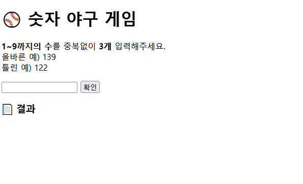
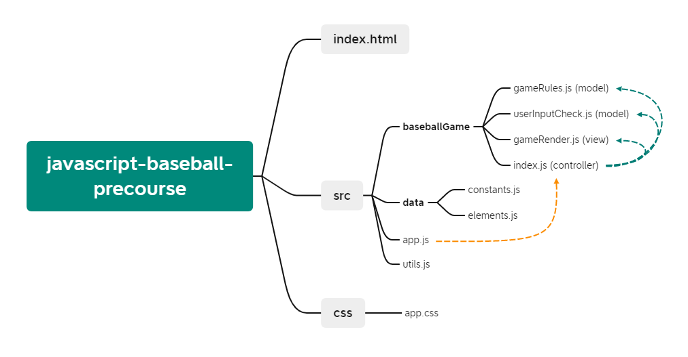
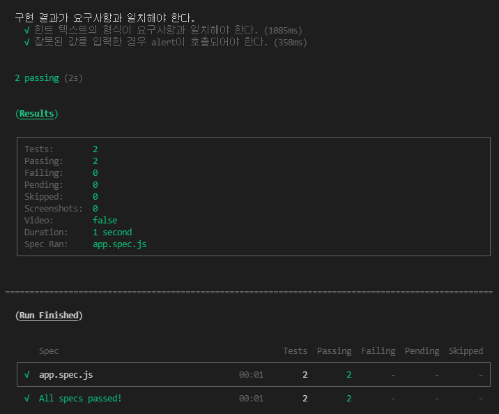

# 프리코스 1주차 - 숫자 야구 게임 ⚾

## 🕹️ 작동 결과

<center>
    
</center>


## 💁‍♂️ 기능 목록

* [x] **사용자 입력 값 유효성 체크**

  🚨 체크 리스트

  * [x] 사용자가 숫자만 입력하였는가?
  * [x] 사용자가 1에서 9 사이의 숫자만 입력하였는가?
  * [x] 사용자가 중복되는 숫자를 입력하지 않았는가?
  * [x] 사용자가 3글자를 입력하였는가?
  * [x] 사용자가 빈칸을 입력하지 않았는가?

* [x] **상대방(컴퓨터) 값 무작위 숫자 추출**

* [x] **사용자가 입력한 String형 숫자값을 배열으로 치환하는 기능**

* [x] **게임 룰을 기반한 사용자와 상대방 값 비교 기능 구현 **

  🚨 체크 리스트

  * [x] 위치한 인덱스와 숫자가 모두 같다 => **스트라이크**
  * [x] 위치한 인덱스는 다르지만 숫자는 같다 => **볼**

* [x] **사용자의 게임 플레이**

  🚨 체크 리스트

  * [x] 스트라이크가 3개이다 => **게임 승리**
  * [x] 스트라이크와 볼 모두 없다 => **낫싱**
  * [x] 볼이 0개 이상이다 => **n볼**
  * [x] 스트라이크가 0개 이상이다 => **n스트라이크**

* [x] **사용자가 확인 버튼을 눌렀을 때 발생하는 이벤트**

* [x] **게임 시도 시 출력 화면 렌더링**

  🚨 체크 리스트

  * [x] 아직 게임이 끝나지 않았을 때
  * [x] 사용자의 정답 입력으로 게임이 종료되었을 때 

* [x] **게임 재시작 요청 이벤트**


## 📁 디렉토리 구조




## 🎯 기능 요구사항 체크

* [x] 같은 수가 같은 자리에 있으면 `스트라이크`, 다른 자리에 있으면 `볼`, 같은 수가 전혀 없으면 `낫싱`이란 힌트를 얻고, 그 힌트를 이용해서 먼저 상대방(컴퓨터)의 수를 맞추면 승리한다.
* [x] 위 숫자 야구게임에서 상대방의 역할을 컴퓨터가 한다. 컴퓨터는 1에서 9까지 서로 다른 임의의 수 3개를 선택한다. 게임 플레이어는 컴퓨터가 생각하고 있는 3개의 숫자를 입력하고, 컴퓨터는 입력한 숫자에 대한 결과를 출력한다.
* [x] 이 같은 과정을 반복해 컴퓨터가 선택한 3개의 숫자를 모두 맞히면 게임이 종료되고, 재시작 버튼이 노출된다.
* [x] 게임이 종료된 후 재시작 버튼을 클릭해 게임을 다시 시작할 수 있다.
* [x] 사용자가 잘못된 값을 입력한 경우 `alert`으로 에러 메시지를 보여주고, 다시 입력할 수 있게 한다.


## ✅ 프로그래밍 요구사항 체크

* [x] `play`(컴퓨터의 랜덤 값, 유저의 입력 값) 메서드를 만들어 게임을 진행한다.
* [x] `play`메서드는 `String`으로 결과값을 return 한다.
  - [x] 스트라이크와 볼이 같이 있는 경우 볼을 먼저쓰고, 스트라이크를 쓴다.
* [x] `index.js`에서 아래의 function 또는 class 형태를 활용한다.

```javascript
export default function BaseballGame() {
  this.play = function (computerInputNumbers, userInputNumbers) {
    return "결과 값 String";
  };
}

export default class BaseballGame {
  play(computerInputNumbers, userInputNumbers) {
    return "결과 값 String";
  }
}

// 예시
play(123, 456); // '낫싱'
play(123, 345); // '1볼'
play(123, 432); // '2볼'
play(123, 312); // '3볼'
play(123, 145); // '1스트라이크'
play(123, 134); // '1볼 1스트라이크'
play(123, 132); // '2볼 1스트라이크'
play(123, 124); // '2스트라이크'
```

* [x] 게임을 다시 시작하는 재시작 button 태그는 `game-restart-button` id를 가진다.
* [x] 외부 라이브러리(jQuery, Lodash 등)를 사용하지 않고, 순수 Vanilla JS로만 구현한다.
* [x] **자바스크립트 코드 컨벤션을 지키면서 프로그래밍** 한다
* [x] **indent(인덴트, 들여쓰기) depth를 3이 넘지 않도록 구현한다. 2까지만 허용**한다.
* [x] **함수(또는 메소드)가 한 가지 일만 하도록 최대한 작게** 만들어라.
* [x] 변수 선언시 `var` 를 사용하지 않는다. `const` 와 `let` 을 사용한다.
* [x] `import` 문을 이용해 스크립트를 모듈화하고 불러올 수 있게 만든다.
* [x] 함수(또는 메소드)의 길이가 15라인을 넘어가지 않도록 구현한다.


## 📚 테스트 결과




## ✍️ 작성자

* 우아한테크코스 프론트엔드 과정 지원자, **류현승**

